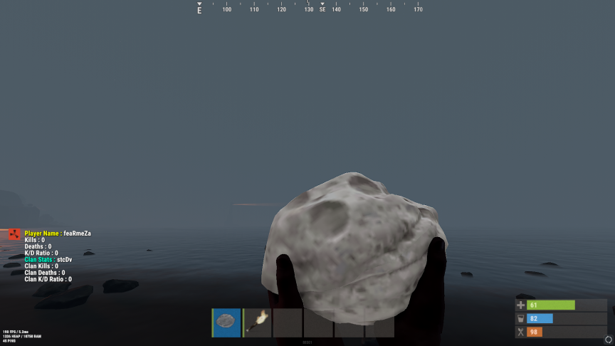

# clanstats

<table>
  <tr>
    <td></td>
    <td></td>
  </tr>
  <tr>
    <td></td>
    <td></td>
  </tr>
</table>

## ClanStats by staticDev

- ClanStats is currently a text based stat tracker for clans and individual players.
- Depends on the Clans by k1lly0u
  
## Permissions:

No permissions needed. Drag and drop to begin using.

## Finished:

/kdr : Player gets their clan and personal stats (text based)

/top : Displays the top 3 clans and their stats (text based)

/myclan : Brings up the current players clan position and kills (text based)

## WIP:

/stats : Brings up a GUI with an option to view player or clan leaderboards will also displays the current players stats and their clan stats

/ckdr : Brings up the current players clan stats if they are in one (text based)

/pkdr : Brings up the current players stats (text based)

/helpclanstats : Brings up a list of available stats for ClanStats

## Dev Log:

10/22/23 - /myclan and /top added! Working on function to call the full clan and player stats separately 

## Config:

A config file has not been introduced yet.

## Shoutouts:

UI Classes and UI development made possible by LaserHydra
KDRGui source code by Ankawi - usable under the MIT license
